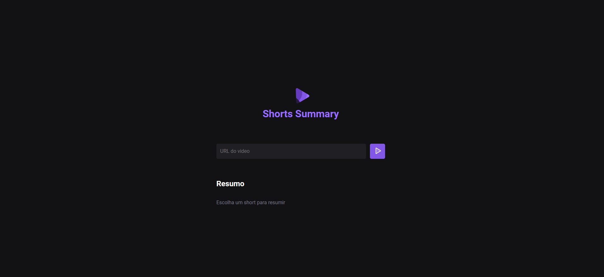
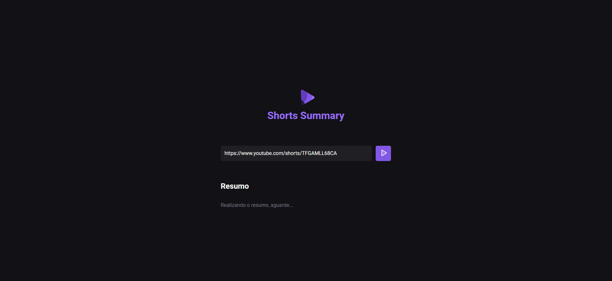
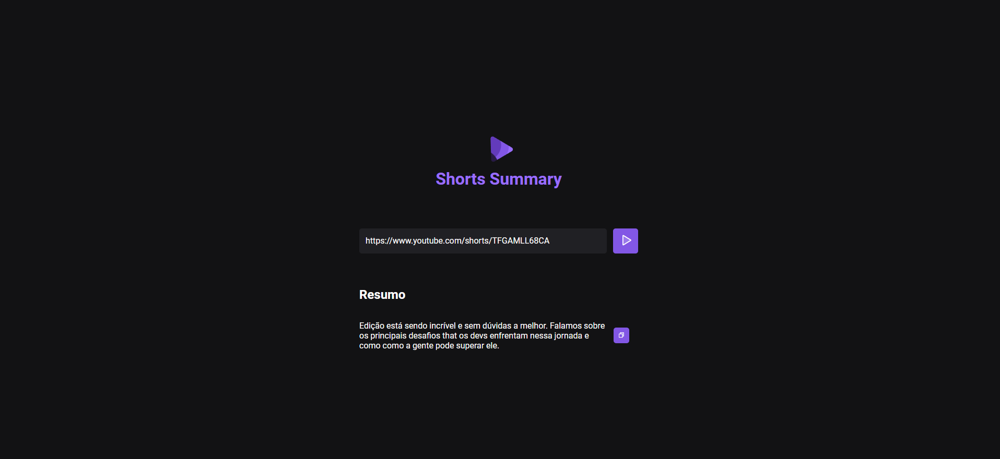

# NLWIA

### 🗒 Sobre

Aplicação web criada acompanhando a trilha Foundations do evento NLWIA, disponibilizado pela Rocketseat. Esta aplicação transcreve e resume o conteúdo do vídeo Shorts do Youtube.
Como desafio pessoal, após a criação do resumo adicionei um botão para que o usuário possa copiar o texto transcrito.

### 🔧 Tecnologias utilizadas
Para o desenvolvimento desta aplicação foram utilizadas as tecnologias:
  -  HTML
  -  CSS 
  -  Javascript 

  ### *Layout* do site
  
  
  
  
